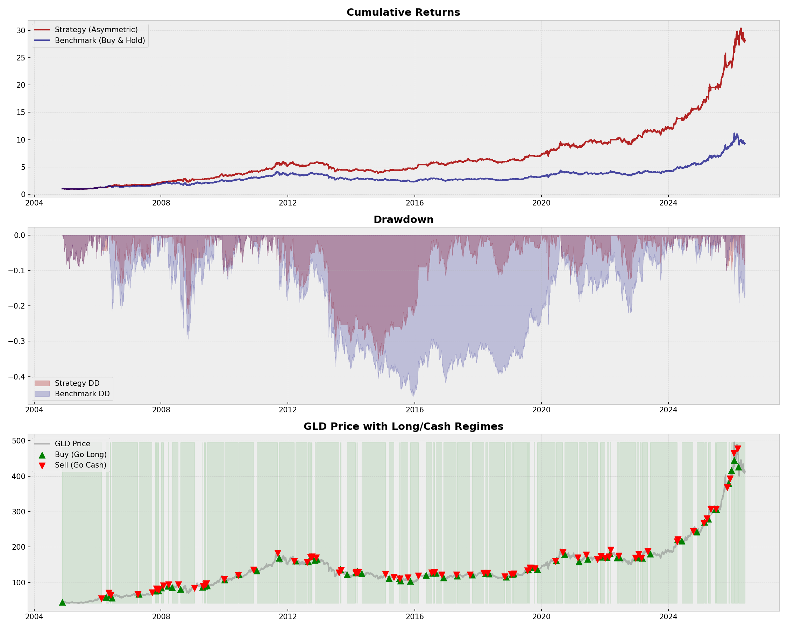
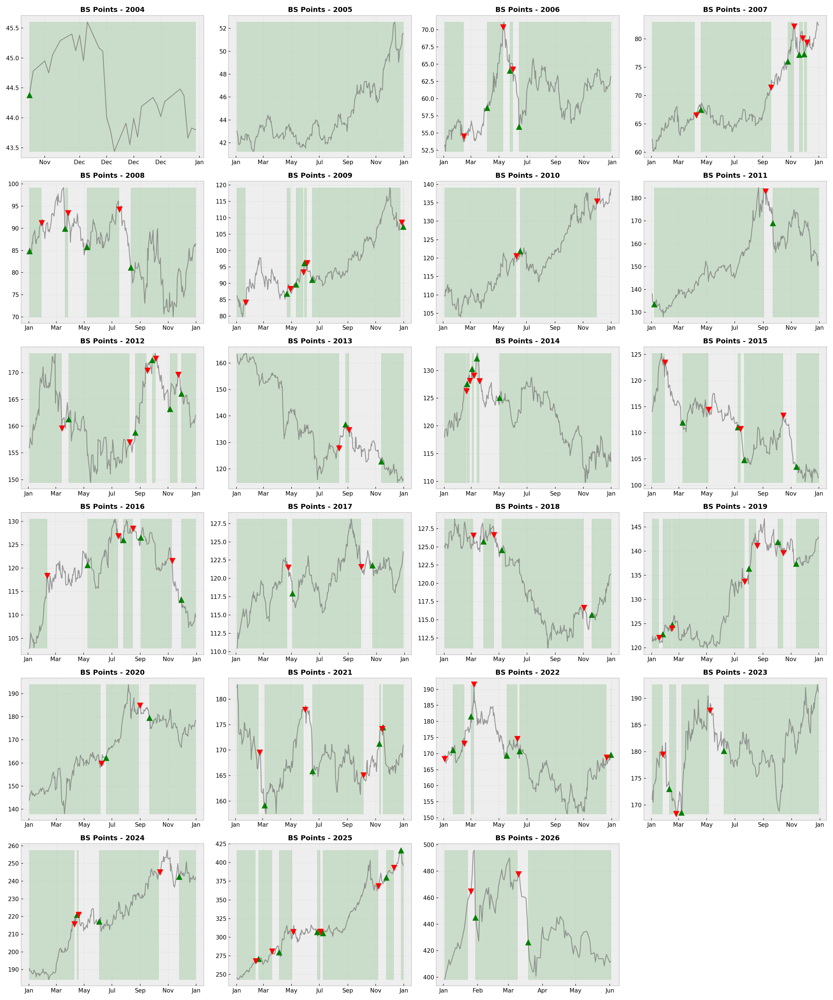

# 黄金多因子量化交易策略 (Gold Factor Quantitative Strategy)

## 🛠️ 策略核心逻辑
本策略采用**非对称多因子阈值模型**来交易黄金(GLD)。通过捕捉 10 个精心挑选的宏观与技术因子，策略在最大化上涨收益的同时，有效规避了黄金历史上的重大回撤。

### 最终严选 10 因子组合
- **趋势与波动 (技术面):** 60日突破 (+), 60日动量衰竭 (-), 波动率扩张 (+), 动量加速度 (+)
- **避险与宏观 (宏观面):** 美债回撤 (+), 黄金美股相关性 (+), 美债动量 (+), 黄金相对美债强势 (-), 黄金相对美股强势 (-), VIX恐慌动量 (+)
- **操作机制:** 综合打分 > -0.15 时入场做多，跌破 -0.45 时清仓避险。

## 📊 策略表现深度解析

### 📈 收益能力指标
| 指标名称 | 数值 | 说明 |
| --- | --- | --- |
| 年化收益率 (Ann Return) | 16.79% | 策略每年的平均复利回报 |
| 基准年化收益 (BM Return) | 10.92% | 一直持有黄金每年的平均回报 |
| 绝对超额收益 (Alpha) | 8.44% | 刨除大盘涨跌后，策略纯粹靠自身能力多赚的钱 |

### 🛡️ 风险控制指标
| 指标名称 | 数值 | 说明 |
| --- | --- | --- |
| 最大回撤 (Max Drawdown) | -35.42% | 历史上买入后遭遇过的最惨亏损幅度。数值越小越好。 |
| 夏普比率 (Sharpe Ratio) | 1.060 | 每承受1单位总风险，能换取多少超额回报。越高越好(>1极佳)。 |
| 索提诺比率 (Sortino Ratio) | 1.284 | 仅评估下跌风险的收益率。比夏普更能反映应对崩盘的能力。 |
| 卡玛比率 (Calmar Ratio) | 0.474 | 年化收益与最大回撤的比例。>1说明回本快，表现优异。 |
| 市场敏感度 (Beta) | 0.765 | 策略对黄金大盘的跟随程度。0.5说明大盘跌10%，策略才跌5%。 |

### ⚖️ 交易统计
| 指标名称 | 数值 | 说明 |
| --- | --- | --- |
| 胜率 (Win Rate) | 53.79% | 所有开仓中，最终赚钱离场的比例。 |
| 市场暴露度 (Exposure) | 79.25% | 资金在市场里的时间占比。40%说明60%时间在空仓避险。 |
| 总交易次数 (Total Trades) | 73 | 回测历史中的完整买卖回合数。 |

## 📈 宏观走势与年度对比

## 🔍 历年精准买卖点切片图
绿色向上箭头 (▲) 表示执行**买入做多**。红色向下箭头 (▼) 表示执行**清仓避险**。绿色阴影区域为满仓阶段。

